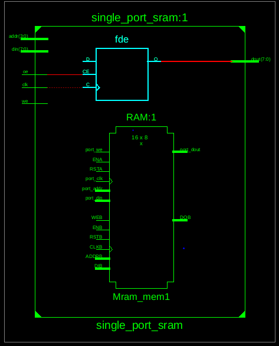
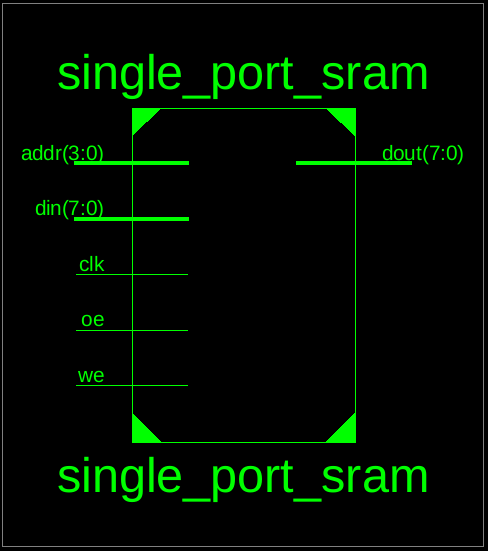
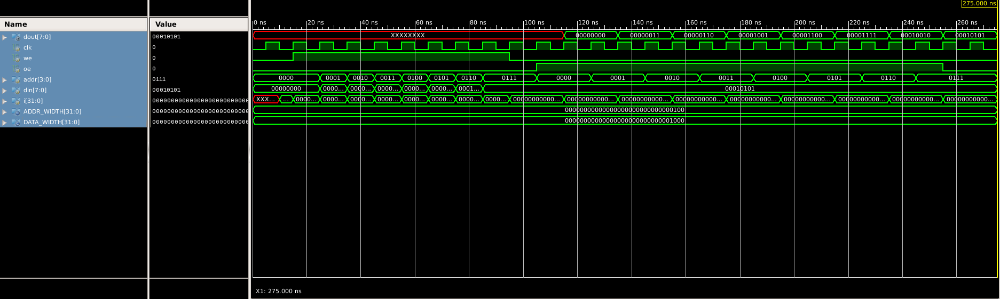

# Single Port SRAM Testbench (Verilog)

## 📘 Overview

This project provides a **comprehensive testbench for a single-port SRAM module** in Verilog. The testbench (`tb_single_port_sram.v`) is designed to verify **both write and read operations** of the SRAM and generate detailed waveforms for simulation and analysis.

The single-port SRAM supports **parameterizable address and data widths**, making it flexible for various memory sizes and applications. This project is particularly useful for FPGA and ASIC designs where understanding SRAM behavior and timing is critical.

Key objectives of this testbench include:

* Validating the correct operation of the single-port SRAM.
* Understanding the interaction between control signals (`we`, `oe`) and data flow.
* Generating readable simulation output for verification.
* Creating waveforms suitable for timing and functional analysis.

---

## 🧩 Project Structure

```
Single_Port_SRAM/
├── single_port_sram.v    # Single-port SRAM Verilog module
├── tb_single_port_sram.v # Testbench for SRAM verification
└── README.md             # Project documentation
```

---

## ⚙️ Testbench Description

### 🧠 Signals

* **Inputs to DUT:**

  * `clk`: System clock (10 ns period)
  * `we`: Write enable (active high)
  * `oe`: Output enable (active high)
  * `addr`: Address input for selecting memory location
  * `din`: Data input to be written to SRAM
* **Outputs from DUT:**

  * `dout`: Data output read from SRAM

### 🔹 Clock Generation

* The testbench generates a **continuous clock** with a period of 10 ns using:

```verilog
always #5 clk = ~clk;
```

* Ensures synchronous operation for read and write cycles.

### 🔹 Write Operation Sequence

1. The testbench iterates through selected addresses.
2. `we` is asserted (`1`) and `oe` is deasserted (`0`) to enable writing.
3. A data pattern is applied to `din` (e.g., `i * 3`) to create a recognizable sequence.
4. Data is latched into the SRAM on the rising edge of `clk`.
5. After all writes, `we` is deasserted to avoid accidental overwrites.

### 🔹 Read Operation Sequence

1. The testbench iterates through the same addresses used in the write operation.
2. `oe` is asserted (`1`) and `we` is deasserted (`0`) to enable reading.
3. On the next rising edge of `clk`, data is read from SRAM and displayed using `$display`:

```verilog
$display("Addr %0d => Data %0d", addr, dout);
```

4. Ensures that the read data matches previously written values, verifying correct SRAM behavior.

### 🔹 Parameters

* `ADDR_WIDTH`: Width of SRAM address bus (default: 4 bits, allows 16 memory locations)
* `DATA_WIDTH`: Width of SRAM data bus (default: 8 bits)
* Parameters can be modified to scale the memory size for larger designs.

### 🔹 Timing Considerations

* All read/write operations are synchronized with `clk` using `@(posedge clk)` statements.
* Ensures that operations respect SRAM setup and hold times.
* Allows accurate waveform analysis for timing verification.

  

  


---

## 📊 Waveform Verification

1. Compile `single_port_sram.v` and `tb_single_port_sram.v` in your simulator (ModelSim, Vivado, eSim).
2. Run simulation and open waveform viewer.
3. Observe the following:

   * `clk`: Clock transitions every 10 ns.
   * `we` and `oe`: Control signals correctly toggle during write and read cycles.
   * `addr`: Correct addresses accessed in sequence.
   * `din` and `dout`: Data written and read matches the expected pattern.
   * Verify `dout` latency relative to `addr` and `oe` assertion.
4. Use the waveform to analyze setup/hold violations or unexpected behavior.

   

---

## 📝 Notes

* The testbench uses a simple data pattern (`i * 3`) for demonstration but can be modified for more complex test vectors.
* `$display` provides console output for verification; combining it with waveform analysis ensures full validation.
* The testbench can be extended to test corner cases like simultaneous `we` and `oe` assertion or random data patterns.
* Parameterization allows the testbench to be reused for different SRAM modules without modification.

---

## 🎯 Key Learning Points

* Single-port SRAM interfacing and control in Verilog.
* Understanding synchronous read/write operations.
* Testbench creation, including clock generation and control signal sequencing.
* Using `$display` and waveform viewers for verification.
* Parameterized Verilog design for scalable and reusable memory modules.
* Timing analysis and validation of setup/hold requirements.

---

## 📂 References

* Verilog HDL Reference Manual
* FPGA memory interfacing tutorials
* Digital system and memory design textbooks
* Single-port SRAM design and simulation guides
